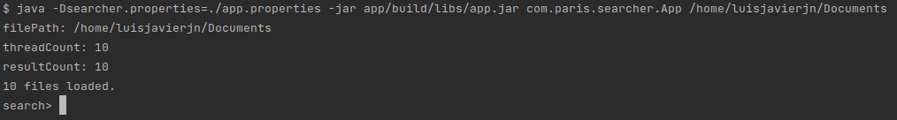

### How to build the program

This program was built using [Gradle](https://docs.gradle.org/current/samples/sample_building_java_applications.html). To build the project run the following command:
```
./gradlew build
```


### How to run the program

This program was developed on Ubuntu 20.04, it uses some properties that can be loaded from the app.property file, otherwise it will set up default values:
```
threadCount = 10
resultCount = 10
```
**threadCount** configure how many threads at the time will be used for reading the text files   
**resultCount** configure how many files are shown in the output report once the search is done  

In order to run the App please type the following command inside the main directory of the project:
```
java -Dsearcher.properties=./app.properties -jar app/build/libs/app.jar com.paris.searcher.App /home/luisjavierjn/Documents
```
The first parameter is the name of the Main-Class and the second parameter is the path for the text files  

  

We can type the words to look for, the app was created to ignore case  

  

Finally, We can just press Enter with no input to exit the application

  


### Unit Tests

The unit tests were developed using JUnit4 and the project has a coverage of 97%